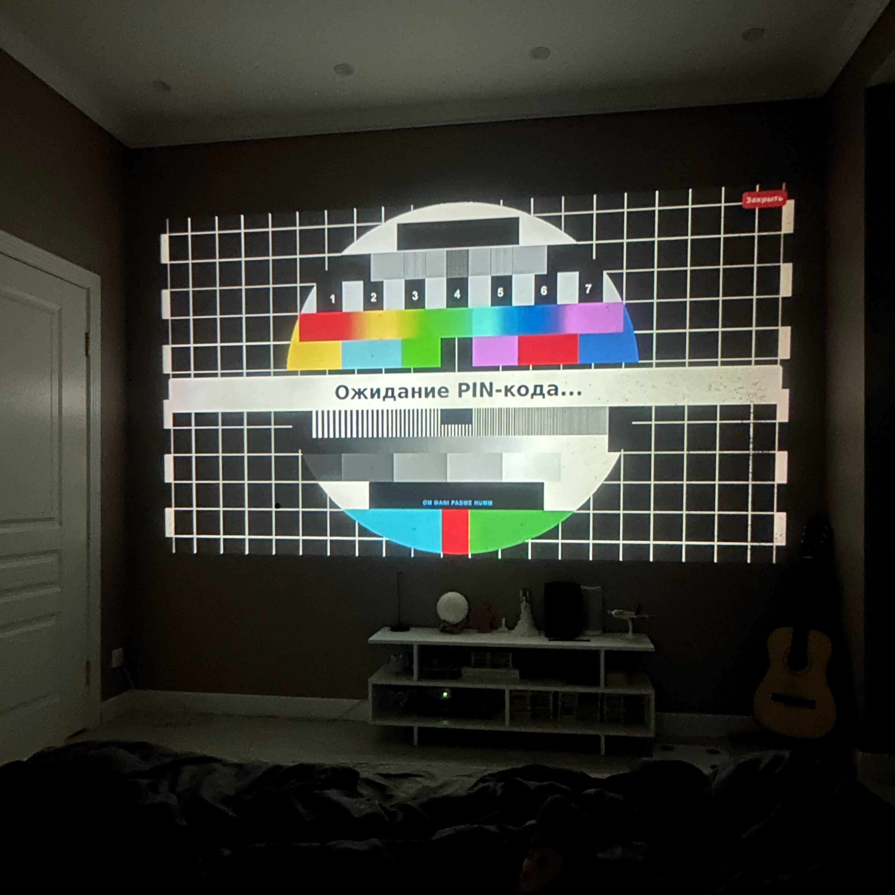

# AirPlay GUI

A PyQt6-based wrapper application for UxPlay that enables wireless connection to my cheap Chinese projector with focus-calibration grid display and PIN code management.

## Overview

This project serves as a user-friendly interface for UxPlay, allowing you to wirelessly connect your projector while automatically displaying a calibration grid for focus adjustment when no device is connected. The calibration grid also shows a PIN code when required for authentication.

## Features

- **Automatic UxPlay Management**: Automatically starts and manages UxPlay processes
- **Calibration Grid Display**: Shows a calibration grid on screen when no device is connected
- **PIN Code Display**: Automatically displays PIN codes when authentication is required
- **Full-Screen Interface**: Clean, distraction-free full-screen interface
- **Process Monitoring**: Monitors UxPlay output and handles connection states
- **Auto-Restart**: Automatically restarts UxPlay if the process terminates unexpectedly (configure in systemd)

## Screenshots

<!-- Add your project screenshots here -->

*Calibration grid with 'waiting for PIN-Code' display*

## Requirements

- Python 3.7+
- PyQt6
- UxPlay installed and configured
- Raspberry Pi OS (Raspbian) Bullseye or newer (tested on Raspberry Pi OS Bullseye 32-bit)
- Hardware: Raspberry Pi 4 Model B+ with at least 4GB RAM
- Hardware acceleration must be enabled (see Raspberry Pi documentation for enabling hardware-accelerated video decoding)
- CPU and GPU overclocking is recommended for optimal performance (configure in /boot/config.txt as per your hardware limits)

## Installation

1. Clone or download this repository
2. Install Python dependencies:
   ```bash
   pip install -r requirements.txt
   ```

3. Ensure UxPlay is installed and configured:
   - Install UxPlay following the official documentation
   - Update the paths in `main.py` to match your UxPlay installation:
     - `UXPLAY_SCRIPT`: Path to your UxPlay startup script
     - `UXPLAY_BIN`: Path to the UxPlay binary
     - `BACKGROUND_IMAGE`: Path to your calibration grid image

4. Configure the startup script (`airplay.sh`) with your preferred UxPlay parameters

## Configuration

### Path Configuration

Edit the following variables in `main.py` to match your system:

```python
UXPLAY_SCRIPT = "/path/to/your/airplay.sh"  # Path to startup script
UXPLAY_BIN = "/path/to/uxplay"              # Main UxPlay binary file
BACKGROUND_IMAGE = "/path/to/grid.jpg"     # Background calibration image
```

### UxPlay Parameters

Modify `airplay.sh` to adjust UxPlay settings:

```bash
#!/bin/bash
cd /path/to/UxPlay/build
GST_PLUGIN_PATH=/usr/lib/gstreamer-1.0 DISPLAY=:0 /usr/local/bin/uxplay \
    -bt709 -s 1280x720 -fps 30 -o -fs -vd v4l2h264dec -nh -v4l2 -avdec \
    -n YourDeviceName -reg
```

## Usage

1. Run the application:
   ```bash
   python main.py
   ```

2. The application will:
   - Start UxPlay automatically
   - Display the calibration grid on screen
   - Show PIN codes when authentication is required
   - Hide the interface when a device connects
   - Show the interface again when connection is lost

3. To exit the application, click the "Close" button or use Ctrl+C

## How It Works

1. **Process Management**: The application starts UxPlay as a subprocess and monitors its output
2. **State Detection**: Parses UxPlay console output to detect:
   - Server initialization
   - PIN code requirements
   - Client connections/disconnections
3. **Interface Control**: Automatically shows/hides the calibration grid based on connection state
4. **PIN Display**: Extracts PIN codes from UxPlay output and displays them prominently

## File Structure

```
AirPlay GUI/
├── main.py              # Main application file
├── airplay.sh           # UxPlay startup script
├── requirements.txt     # Python dependencies
├── test_table_1.jpg     # Calibration grid image 1
├── test_table_2.jpg     # Calibration grid image 2
└── README.md           # This file
```

## Troubleshooting

### UxPlay Not Starting
- Check that UxPlay is properly installed
- Verify the paths in `main.py` are correct
- Ensure the startup script (`airplay.sh`) has execute permissions

### Display Issues
- Verify the background image path is correct
- Check that your display resolution matches the expected format
- Ensure PyQt6 is properly installed

### Connection Problems
- Check UxPlay logs in `uxplay.log`
- Verify network connectivity
- Ensure firewall allows AirPlay connections

## Dependencies

- `PyQt6`: GUI framework
- `psutil`: Process management
- `subprocess`: Process execution
- `threading`: Background process monitoring

## License

This project is provided as-is for educational and personal use.

## Contributing

Feel free to submit issues and enhancement requests!
